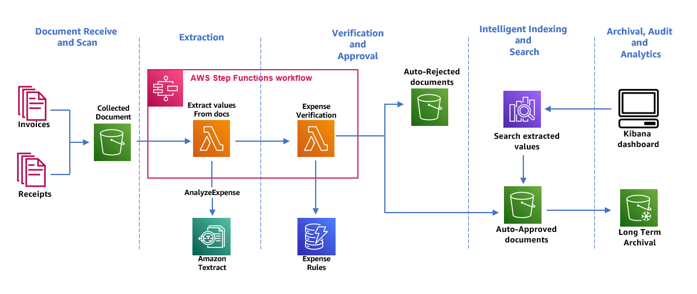

## Build a receipt and invoice processing pipeline with Amazon Textract
The repository provides a reference architecture to  build a invoice automation pipeline that enables extraction, verification, archival and intelligent search.

### Architecture
The following architecture diagram shows the stages of a receipt and invoice processing workflow. It starts with a Document Capture stage to securely collect and store scanned invoices and receipts. The next stage is the extraction phase where we pass the collected invoices and receipts to Amazon Textract’s AnalyzeExpense API to extract financially related relationships between text such as Vendor Name, Invoice Receipt Date, Order Date, Amount Due/Paid, etc. In the next stage, we use few pre-defined expense rules to determine if we should auto-auto approve or reject our receipt. Auto approved and rejected documents go to their respective S3 buckets. For auto-approved documents, you can search all the extracted fields and values using OpenSearch. The indexed metadata can be visualized using OpenSearch dashboard.. Auto-approved documents are also set up to be moved to Glacier Vault for long term archival using S3 lifecycle policies. 



### Steps to deploy

####  Create ECR and build/publish images
This step involves creating ECR repositories for the lambda functions, building the container images and pushing them to the respective respositories. The following steps require presence of [podman](https://github.com/containers/podman) and [aws](https://aws.amazon.com/cli/) cli.
``` bash
# Windows users: run these commands on linux like terminal eg. gitbash
parse_invoices_ecr_uri=$(aws ecr create-repository --repository-name textract/parse_invoices --image-scanning-configuration scanOnPush=true --image-tag-mutability MUTABLE --encryption-configuration encryptionType=KMS --query 'repository.repositoryUri' --output text)

expense_verification_ecr_uri=$(aws ecr create-repository --repository-name textract/expense_verification --image-scanning-configuration scanOnPush=true --image-tag-mutability MUTABLE --encryption-configuration encryptionType=KMS --query 'repository.repositoryUri' --output text)

export image_tag="0.0.1"

cd lambda/parse_invoices
podman build . -t parse_invoices --platform=linux/amd64
podman tag parse_invoices ${parse_invoices_ecr_uri}:${image_tag}
aws ecr get-login-password | podman login -u AWS --password-stdin ${parse_invoices_ecr_uri}
podman push ${parse_invoices_ecr_uri}:${image_tag}

cd ../expense_verification
podman build . -t expense_verification --platform=linux/amd64
podman tag expense_verification ${expense_verification_ecr_uri}:${image_tag}
aws ecr get-login-password | podman login -u AWS --password-stdin ${expense_verification_ecr_uri}
podman push ${expense_verification_ecr_uri}:${image_tag}
```
#### Create Resources
After the images are pushed to ECR, deploy the cloudformation stack: `textract.yml` and ensure to provide correct values for ECR repo names and image tags. The stack creates the following:
1. S3 buckets for input, approved and denied receipts/invoices
2. Dynamodb table holding invoice validation rules
3. Lambda functions for parsing and verifying receipts/invoices
4. State Machine/Lambda Step functions
5. EventBridge rule to trigger on new file upload to S3 input bucket and trigger the State Machine for processing
6. Opensearch domain for ingesting invoice information

**_NOTE:_** If you receive the message on click of OpenSearch Dashboard: {"Message":"User: anonymous is not authorized to perform: es\:ESHttpGet with an explicit deny"}, you may have accidentally misconfigured the security settings of your domain. Go back to your domain in the AWS console and click on Actions, then Edit security configuration. Ensure that Only use fine-grained access control is selected, and click Save changes.

After the cloudformation stack is complete, create a couple of validation rules in Dynamodb table. You can open CloudShell from AWS Console and run these commands:
```bash
aws dynamodb execute-statement --statement "INSERT INTO \"$(aws cloudformation list-exports --query 'Exports[?Name==`InvoiceProcessorWorkflow-RulesTableName`].Value' --output text)\" VALUE {'ruleId': 1, 'type': 'regex', 'field': 'INVOICE_RECEIPT_ID', 'check': '(?i)[0-9]{3}[a-z]{3}[0-9]{3}$', 'errorTxt': 'Receipt number is not valid. It is of the format: 123ABC456'}"
aws dynamodb execute-statement --statement "INSERT INTO \"$(aws cloudformation list-exports --query 'Exports[?Name==`InvoiceProcessorWorkflow-RulesTableName`].Value' --output text)\" VALUE {'ruleId': 2, 'type': 'regex', 'field': 'PO_NUMBER', 'check': '(?i)[a-z0-9]+$', 'errorTxt': 'PO number is not present'}"
```

Test the functionality by uploading a few invoices to the input S3 bucket. A couple of sample invoices are provided in the repo. After upload, you should see receipts either getting approved or denied and landing in respective buckets. The reciept metadata is also pushed to Opensearch domain. You can use the file: `invoices.ndjson` to import index pattern, visulatization and dashboard:
* Login to OpenSearch Dashboard using the credentials stored in Secrets Manager
* Click on Stack Management, Saved Objects and Import
* Upload the file and confirm overwrite conflicts
* After the upload is complete, refresh the browser and you should see Invoices under Dashboard screen
* You can open the dashboard, change time interval and filters to view processed records


## Security

See [CONTRIBUTING](CONTRIBUTING.md#security-issue-notifications) for more information.

## License

This library is licensed under the MIT-0 License. See the LICENSE file.

